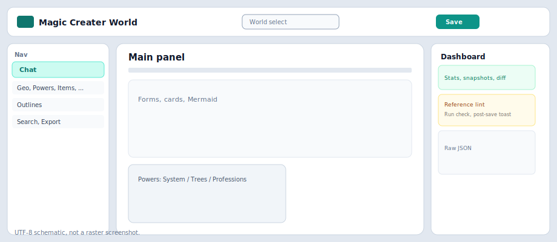
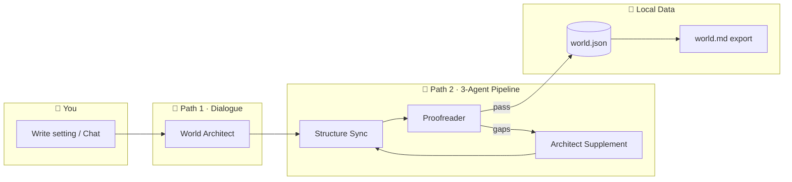
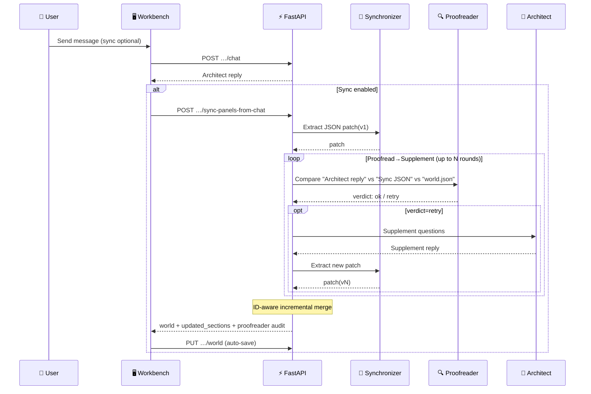
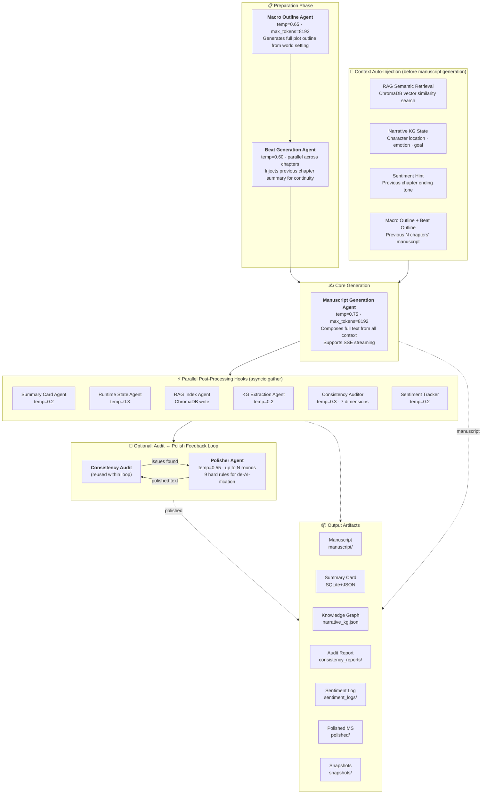
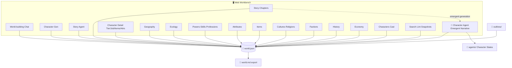

<div align="center">


**Turn inspiration from conversation into a complete, saveable, exportable world.**

[](https://www.python.org/)
[](https://fastapi.tiangolo.com/)
[](https://docs.pydantic.dev/)
[](https://pytest.org/)
[](https://platform.openai.com/)

</div>

<p align="center">
  <a href="README.md"></a>
  <a href="README.en.md"></a>
</p>

---

## Table of Contents

- [Quick Start](#quick-start)
- [What It Does](#what-it-does)
- [UI Overview](#ui-overview)
- [Overall Workflow](#overall-workflow)
- [Story Writing Multi-Agent Orchestra](#story-writing-multi-agent-orchestra)
- [Feature Tour](#feature-tour)
- [Product Map (Workbench ↔ world.json)](#product-map-workbench--worldjson)
- [Requirements & Installation](#requirements--installation)
- [Configuration](#configuration)
- [Launching the Server](#launching-the-server)
- [Data Directory Structure](#data-directory-structure)
- [API Summary](#api-summary)
- [Testing](#testing)
- [Roadmap](#roadmap)
- [More Documentation](#more-documentation)

---

## Quick Start

### Windows One-Click Setup (Recommended)

```
1. Double-click setup.bat   → Auto-detect environment, install deps, configure .env
2. Double-click launch.bat  → Start server, browser opens automatically
```

> Optional: right-click `launch.bat` → Send to desktop → right-click shortcut → Properties → Change Icon → select `icon.ico` for one-click desktop launch.

### Manual Setup

```bash
# 1. Create virtual environment (recommended)
python -m venv .venv

# Activate on Linux / macOS
source .venv/bin/activate

# Activate on Windows
.venv\Scripts\activate

# 2. Install dependencies
pip install -r requirements.txt

# 3. Configure your API key
cp .env.example .env          # Linux / macOS
copy .env.example .env        # Windows
# Edit .env and fill in PARATERA_API_KEY

# 4. Launch
python run.py
```

The app opens automatically at `http://127.0.0.1:8765`. Start building your world.

---

## What It Does

**Magic Creater World (MCW)** is a local-first, AI-assisted world-building workbench for fiction writers, game masters, and roleplayers. It turns LLM conversations into structured, persistent, exportable world data.

<div align="center">

| ✨ Core Feature | Description |
|:--|:--|
| 📌 **Single Source of Truth** | `world.json` on disk is the authoritative structure; `world.md` is the human-readable export |
| 💬 **Conversational Building** | Chat with a "World Architect" LLM agent in natural language across 4 creative modes (Novel / Game / CoC / DnD) |
| 🧩 **Structure Sync + Proofreader** | 3-Agent pipeline: Architect→Synchronizer→Proofreader→Supplement loop, auto-extracting JSON patches with ID-aware incremental merge into forms |
| 🗺️ **11 World Modules** | Geography · Ecology · Power System · Attributes · Items · Cultures · Factions · History · Economy · Characters · Story |
| 📊 **Relationship Visualization** | vis.js interactive character relationship network (drag/zoom); Mermaid diagrams: skill trees, profession graphs, timelines, causal chains |
| 🧠 **Semantic Memory (RAG)** | Local vector index (ChromaDB) with semantic retrieval of prior narrative fragments for coherence |
| 🔍 **Data Tools** | Full-text search, reference consistency linting & auto-fix, world.json version snapshots with diff & rollback, chapter version snapshots |
| 📤 **Multi-format Export** | Auto-generated `world.md`; EPUB / DOCX / Markdown full-book export; outlines written to `outlines/` |
| 📈 **Writing Stats Dashboard** | Chart.js visualization: word count, chapter completion, foreshadowing status, sentiment distribution |
| 🧠 **Character Agent Emergent Narrative** | 15+ module Agent system: character decision engine, multi-character scene simulator, single-POV filter, quality scoring (A-F), multi-chapter semi-autonomous runner |
| ⏱️ **LLM Timing Analysis** | Per-generation timing breakdown showing LLM call duration for each stage |
| 💾 **Local-First** | All data lives on your disk — no cloud service required |

</div>

### Two Conversation Paths (3-Agent Pipeline)

| Path | Description |
|:--|:--|
| **Path 1 · Dialogue** | Natural language chat with the "World Architect"; optionally attach `world.md` as context |
| **Path 2 · Structure Sync** | 3-Agent pipeline: **Synchronizer** extracts JSON from architect reply → **Unified Proofreader** audits completeness AND directly outputs missing JSON in a single call (no architect round-trip) → **ID-aware incremental merge** — existing entries updated, new entries appended, never overwritten. Empty synchronizer output automatically skips proofreading. |

The structure sync model defaults to the main chat model. Set `STRUCTURE_SYNC_MODEL` to use a different one. The proofreader model can be set via `PROOFREADER_MODEL` (use a smaller model for speed). Proofreading rounds can be configured via `PROOFREADER_MAX_RETRIES` and adjusted in the UI (0 = skip proofreader).

---

## UI Overview

The workbench uses a **three-column layout**: top bar + left navigation + main panel + right dashboard.

<div align="center">


*Top bar: world selector, save, quit; Left: conversation & module navigation; Center: chat or form editor; Right: stats dashboard & JSON viewer*

</div>

### Chat View


*Sync options, creative mode selector, quick chips, message list, composer (Ctrl+Enter to send)*

### Full Layout Detail



*Header, nav, main panel with forms/cards/Mermaid diagrams, and dashboard with stats/snapshots/reference lint/raw JSON*

---

## Overall Workflow



**3-Agent Sync Pipeline (sequence)**



---

## Story Writing Multi-Agent Orchestra

The story writing module uses a **Multi-Agent Orchestra** architecture, where 15+ specialized agents collaborate to take a chapter from outline to polished manuscript. Each agent has a single responsibility and independently tuned temperature, achieving high efficiency and quality through **parallel post-processing** and an **optional feedback loop**. New: **Character Agent Emergent Narrative System** — important characters have independent LLM-driven decision engines; narrative emerges from autonomous character interactions.

### Agent Collaboration Architecture



### Character Agent Emergent Narrative System (Phase 0-3 Complete)

Each major character has an independent LLM-driven decision engine. The narrative is no longer pre-planned by a single "writer agent" — it **emerges** from autonomous interactions between multiple character agents within a scene.

**Core Architecture**:

```
generate_manuscript()
  │
  ├── enable_character_agents == true?
  │     └── YES → _generate_manuscript_with_agents()
  │               ├── OutlineConstraint.parse()        # macro constraints
  │               ├── AgentStore.load_all_states()     # character states
  │               ├── _inject_character_capabilities() # skills/items/attrs/rules
  │               ├── WorldClock.advance_chapter()     # time + external events
  │               ├── SceneSimulator.run()             # intent leak + emotional contagion
  │               ├── POVFilter.filter()               # single-POV filtering
  │               ├── ShadowInfluence                  # off-screen → environment hints
  │               ├── BeatCoordinator.classify()       # beat deviation coordination
  │               ├── chat_completion()                # writer agent
  │               └── QualityEvaluator.evaluate()      # A-F quality scoring
  │
  └── failure → auto-fallback to normal generation (terminal + frontend toast)
```

**17 Agent Modules**: `character_agent` · `scene_simulator` (V2: intent leak + emotional contagion + 6 stuck breakers) · `pov_filter` · `state_injector` · `outline_constraint` · `beat_reference` · `continuity_checker` · `agent_store` · `dialog_quality` (3-axis scoring) · `beat_coordinator` (4-level deviation + auto-coordination) · `world_clock` · `shadow_influence` · `scene_assembler` · `quality_evaluator` (5-dim A-F) · `autonomy` (L1-L3) · `chapter_runner` (multi-chapter semi-autonomous)

**Key Features**:
- **Single POV**: POVFilter strictly limits output to the viewpoint character's perception boundary
- **Macro outline as skeleton**: world events are hard constraints; characters decide "how to respond"
- **Beat as reference**: optional soft hints; character decisions take priority
- **Cross-chapter continuity**: 7-point state continuity check before and after each chapter
- **Per-character temperature**: rational (0.35) → protagonist (0.55) → emotional (0.65) → semi-nonhuman (0.75)
- **Graceful fallback**: agent failure → terminal + toast notification → automatic normal generation

**UI**: Writing panel toggle switch + Agent Decision Analysis dashboard (quality chart + decision log + state overview) + Character Detail overlay (skills/items/attributes/activation rules)

**Tests**: 55 dedicated unit tests + 14 E2E tests

### Agent Responsibilities

| Phase | Agent | Temp | Responsibility |
|:--|:--|:--|:--|
| **Prep** | Macro Outline Agent | 0.65 | Generate full plot outline from user prompt and world setting |
| **Prep** | Beat Generation Agent | 0.60 | Write detailed beats per chapter; parallel generation with previous-chapter summary injection for continuity |
| **Inject** | RAG Semantic Retrieval | — | ChromaDB vector similarity search; auto-inject relevant prior fragments |
| **Inject** | Narrative KG | — | Provide character current state (location / emotion / goal) and key item flow |
| **Inject** | Sentiment Hint | — | Pass previous chapter ending tone to guide opening emotional transition |
| **Core** | Manuscript Generation Agent | 0.75 | Compose full chapter text from all assembled context; supports SSE streaming |
| **Post** | Summary Card Agent | 0.2 | Extract chapter summary (events / characters / foreshadowing / ending hook) |
| **Post** | Runtime State Agent | 0.3 | Extract and persist per-character runtime state changes from manuscript |
| **Post** | RAG Index Agent | — | Write new chapter into ChromaDB vector index for future retrieval |
| **Post** | KG Extraction Agent | 0.2 | Extract entity-event-foreshadowing triples; update narrative knowledge graph |
| **Post** | Consistency Auditor | 0.3 | 7-dimension automatic audit: position / personality / item state / POV / foreshadowing / emotional continuity / timeline |
| **Post** | Sentiment Tracker | 0.2 | Per-segment emotional tone analysis; generate sentiment arc |
| **Loop** | Polisher Agent | 0.55 | Feedback loop with consistency audit (up to N rounds); 9 hard rules for de-AI-ification: dash restraint, paragraph merging, sentence variation, concrete emotion, dialogue rhythm, redundancy pruning, triple-pass refinement, sensory-anchored description, layered information density |

### Key Design Principles

- **Non-blocking Hooks**: All post-processing hooks are wrapped in `try/except Exception: pass` — any single agent failure never blocks manuscript output
- **Parallel Acceleration**: Summary card, runtime state, RAG indexing, KG extraction, consistency audit, and sentiment tracking — 6 independent hooks run concurrently via `asyncio.gather`
- **Loop Isolation**: The polisher runs **sequentially** after all parallel hooks complete, avoiding conflicts with the standalone consistency audit
- **Temperature Differentiation**: Creative tasks (manuscript 0.75, polisher 0.55) use higher temperature; extraction tasks (summary 0.2, KG 0.2, sentiment 0.2) use low temperature for stable, deterministic output
- **Context Window Layering**: Manuscript generation only injects previous chapter summary + prior N chapters' excerpts + RAG-retrieved fragments, preventing context bloat

---

## Feature Tour

### 🌍 World Modules (11)

| Module | Core Features | Visualization |
|:--|:--|:--|
| **Geography** | Continent / region cards; region relationships | Relationship network (Mermaid) |
| **Ecology** | Biomes, species, encounter dialogue | One-click AI ecology generation |
| **Power System** | Realm tiers, skill trees, profession system | Profession promotion graph (Mermaid) |
| **Attributes** | Generic character stat dimensions | Radar reference chart |
| **Items** | Quality tier cards with rarity narrative | Tier preview cards |
| **Cultures** | Culture / religion / syncretic entity cards | Entity relationship diagram (Mermaid) |
| **Factions** | Organization overview, single-card profiles | Global relationship graph (zoomable + pannable) |
| **History** | Major event management | Timeline + causal chain diagram |
| **Economy** | Currencies, markets, trade routes, goods | ID-aligned with Geography/Factions |
| **Characters** | Protagonist core, supporting cast, cast JSON | vis.js interactive character relationship network (drag/zoom) |
| **Story** | Chapters, macro outlines, beat outlines, manuscripts | Foreshadowing timeline · RAG semantic retrieval · Narrative KG · Consistency audit · Sentiment arc · Chapter snapshots · EPUB/DOCX export · Stats dashboard |

### 🤖 AI Conversation Features

| Feature | Description |
|:--|:--|
| **World-building Chat** | Free-form conversation with the Architect agent; quick chips; Ctrl+Enter to send |
| **Character Generation** | Dedicated chat thread with optional guide and structure sync |
| **Story Agent** | Tool calling: foreshadowing CRUD, manuscript generation, auto-detection of markdown code blocks |
| **RAG Semantic Retrieval** | Local vector index (ChromaDB + BGE embedding), intelligently retrieves relevant prior fragments for writing context |
| **Narrative Knowledge Graph** | Lightweight event-entity-time triples tracking character state evolution and key item flow |
| **Consistency Auditor** | 7-dimension automatic audit (position / personality / items / POV / foreshadowing / emotional continuity / timeline), non-blocking post-chapter check |
| **Sentiment Arc Tracker** | Per-chapter emotional tone analysis + Mermaid curve visualization for cross-chapter emotional coherence |
| **Polisher Agent** | Consistency-audit ↔ polish feedback loop (up to N rounds), 9 hard rules for de-AI-ification (dash restraint / paragraph merging / sentence variation / show-don't-tell / etc.), original ↔ polished side-by-side diff comparison |
| **Creative Modes** | Novel / Game / CoC / DnD — each injects different system prompts and terminology |
| **One-click Ecology** | Auto-generate ecology settings from current world context |
| **Character Agent System** | 15+ modules: LLM decision engine, scene simulator, POV filter, intent leak detection, emotional contagion, dialog quality scoring, beat deviation coordination, WorldClock, shadow influence, 5-dim quality evaluator (A-F), 3-tier autonomy (Advisor/Semi/Full), multi-chapter runner |
| **Chinese Punctuation Norm** | Deterministic rule engine (zero token cost): fullwidth/halfwidth unification, quote pairing, ellipsis/dash fixes |
| **Truncation Auto-Continuation** | Detects LLM output truncation → up to 5 rounds of auto-continuation → wrap-up paragraph |
| **Macro Outline Large Token** | 32768 max_tokens + auto-continuation for 85+ chapter outlines |
| **Terminal Error Logging** | Global HTTP/Validation/Unhandled exception handlers — UI errors printed to terminal |

### 🔧 Data Tools

| Tool | Description |
|:--|:--|
| **Full-text Search** | Searches both `world.json` and `world.md` simultaneously |
| **Reference Linter** | Cross-module ID reference validation (regions, factions, etc.) |
| **Auto-fix** | Conservative reference repair with `dry_run` preview |
| **Version Snapshots** | Auto-snapshot on every save; line-level diff viewer; one-click rollback; per-snapshot delete |
| **Chapter Version Snapshots** | Auto-snapshot on manuscript save (max 10 versions); line-level diff between any two versions |
| **Multi-format Export** | One-click export to EPUB (e-book) / DOCX (Word) / Markdown with proper Chinese filename handling |
| **Writing Stats Dashboard** | Chart.js dashboard: total word count, chapter progress, foreshadowing status distribution, sentiment tone distribution |
| **LLM Timing Panel** | Per-stage LLM call duration bar chart displayed after manuscript generation (outline/beats/manuscript/summary/KG/sentiment) |
| **RAG Index Readiness Indicator** | Story workbench header status dot + sidebar context panel (prev-chapter summary / character states / index stats) |
| **world.md Export** | Auto-generate human-readable handbook from JSON |

### 🌐 World Management

Use the top bar to **create / rename / delete** worlds. The dropdown shows **display name · id**. **Save** (Ctrl+S / ⌘S) writes to disk. **Quit** shuts down the server process.

---

## Product Map (Workbench ↔ world.json)

How the SPA panels map to the local `world.json`:



---

## Requirements & Installation

### Requirements

- **Python 3.10+**
- An OpenAI-compatible API gateway (default: `https://llmapi.paratera.com/v1`) with a valid API key

### Install Dependencies

```bash
pip install -r requirements.txt
```

Dependency overview:

| Package | Purpose |
|:--|:--|
| `fastapi` | Web API framework |
| `uvicorn` | ASGI server |
| `openai` | LLM client (OpenAI-compatible) |
| `pydantic` + `pydantic-settings` | Data validation & config management |
| `python-dotenv` | Environment variable loading |
| `httpx` | Async HTTP client |
| `chromadb` | Local vector database (RAG semantic retrieval) |
| `sentence-transformers` | Local text embedding (BAAI/bge-small-zh-v1.5) |
| `ebooklib` | EPUB e-book generation |
| `python-docx` | DOCX Word document generation |
| `pytest` | Test framework |

For Conda environments, specify your interpreter path:

```powershell
& "E:\ananconda\envs\Agent\python.exe" -m pip install -r requirements.txt
```

---

## Configuration

Copy the environment template and edit:

```bash
# Linux / macOS
cp .env.example .env

# Windows (PowerShell / CMD)
copy .env.example .env
```

Key variables:

| Variable | Description | Default |
|:--|:--|:--|
| `PARATERA_API_KEY` | OpenAI-compatible API key | *(required)* |
| `OPENAI_API_BASE` | API gateway URL | `https://llmapi.paratera.com/v1` |
| `OPENAI_CHAT_MODEL` | Chat model name | `DeepSeek-V4-Flash` |
| `STRUCTURE_SYNC_MODEL` | Optional: dedicated model for structure sync | Same as `OPENAI_CHAT_MODEL` |
| `PROOFREADER_MODEL` | Optional: dedicated model for proofreader (use smaller model for speed) | Same as `STRUCTURE_SYNC_MODEL` |
| `PROOFREADER_MAX_RETRIES` | Optional: max proofreader→architect supplement rounds (0=skip) | `3` |
| `MCW_EMBEDDING_MODEL` | Optional: local embedding model name | `BAAI/bge-small-zh-v1.5` |
| `MCW_EMBEDDING_BACKEND` | `auto` / `api` / `local`: `auto` skips HuggingFace if model not cached | `auto` |
| `MCW_HF_ENDPOINT` | Optional HF mirror (e.g. `https://hf-mirror.com`) | *(empty)* |
| `WORLDS_DIR` | Optional: custom worlds root directory | `worlds/` |

> 💡 **Temporary key** (not written to `.env`, expires with terminal session):
>
> ```bash
> # Windows PowerShell
> $env:PARATERA_API_KEY = "your-key"
> python run.py
>
> # macOS / Linux
> PARATERA_API_KEY="your-key" python run.py
> ```

---

## Launching the Server

### Basic Launch

```bash
python run.py
```

Opens `http://127.0.0.1:8765` in your default browser after ~1 second.

### Common Options

| Option | Description |
|:--|:--|
| `--host 0.0.0.0` | Listen on all network interfaces |
| `--port 8765` | Custom port |
| `--reload` | Auto-reload on code changes (dev mode) |
| `--no-browser` | Don't auto-open browser |

```bash
# LAN access
python run.py --host 0.0.0.0 --port 8765

# Development with auto-reload
python run.py --reload
```

> Using `--reload` automatically sets `MCW_NO_STATIC_CACHE=1` to disable frontend caching, preventing stale `app.js` from being served.

### Alternative Launch

```bash
python -m uvicorn app.main:app --host 127.0.0.1 --port 8765
```

### Quitting

Use the top-bar **"Quit"** button to call `POST /api/shutdown`, which stops the Uvicorn process and attempts to close the browser tab (loopback only).

---

## Source Code Structure

```
worldforger/
  ├─ schemas.py, config.py, llm.py   ← Core
  ├─ world_store.py, creative_modes.py  ← World management
  ├─ chapter_indexer.py              ← ChromaDB RAG
  ├─ consistency_checker.py, sentiment_tracker.py, narrative_kg.py  ← Analysis
  ├─ reference_linter.py, world_search.py  ← Tools
  ├─ punctuation_normalize.py        ← Chinese punctuation norm
  │
  ├─ story/              ← Story system (7 files)
  │   ├─ story_service.py    ← Generation core
  │   ├─ story_agent.py      ← Chat agent with tools
  │   ├─ story_prompts.py    ← All LLM prompts (~2,000 lines)
  │   └─ ...
  │
  ├─ agents/             ← Character Agent system (17 files)
  │   ├─ character_agent.py, scene_simulator.py, pov_filter.py
  │   ├─ quality_evaluator.py, autonomy.py, chapter_runner.py
  │   └─ ...
  │
  └─ sync/               ← Structured sync (4 files)

app/
  └─ main.py             ← FastAPI routes (all /api/* endpoints)

static/
  ├─ app.js, index.html, styles.css  ← Frontend
  └─ js/                 ← Utilities / state / charts
```

---

## Data Directory Structure

Each world lives under `worlds/<world_id>/`:

```
worlds/
└── Twilight-of-the-Gods-58bddae5/
    ├── world.json          ← Authoritative structured data
    ├── world.md            ← Human-readable handbook (auto-exported)
    ├── manifest.json       ← Creation metadata & gateway info
    ├── outlines/           ← Character & plot outline exports
    ├── story/               ← Chapter manuscripts, summary cards, RAG index
    │   ├── macro_outline.md
    │   ├── beats/             ← Beat outlines
    │   ├── manuscript/        ← Manuscript originals
    │   ├── summaries/         ← Chapter summary cards
    │   ├── polished/          ← Polished manuscripts
    │   ├── snapshots/         ← Chapter version snapshots
    │   ├── consistency_reports/  ← Consistency audit reports
    │   ├── sentiment_logs/    ← Sentiment logs
    │   ├── rag_index/         ← ChromaDB vector index
    │   ├── arc_summaries/     ← Rolling arc summaries (every 10 chapters)
    │   ├── knowledge_graph.json ← Character knowledge graph
    │   └── token_usage.json   ← Token usage statistics
    ├── agents/            ← Character agent states (agent_state.json / decision_log.jsonl)
    ├── sessions/           ← Chat session logs (optional)
    └── snapshots/          ← Version snapshots
        ├── v001.json
        ├── v002.json
        └── ...
```

---

## API Summary

> Full route definitions in `app/main.py`.

| Method | Path | Description |
|:--|:--|:--|
| `GET` | `/api/health` | Health check |
| `GET` | `/api/config` | Public config (model name, key status) |
| `POST` | `/api/shutdown` | Stop server (loopback only) |
| `GET` | `/api/worlds` | List all worlds |
| `POST` | `/api/worlds` | Create a world |
| `GET` | `/api/worlds/{id}` | Load a world |
| `PUT` | `/api/worlds/{id}` | Save complete world |
| `PATCH` | `/api/worlds/{id}` | Rename display name |
| `DELETE` | `/api/worlds/{id}` | Delete world |
| `POST` | `/api/worlds/{id}/chat` | World-building chat |
| `POST` | `/api/worlds/{id}/character-chat` | Character generation chat |
| `POST` | `/api/worlds/{id}/story-chat` | Story agent chat (with tools) |
| `POST` | `/api/worlds/{id}/sync-panels-from-chat` | Structure sync (with proofreader audit) |
| `POST` | `/api/worlds/{id}/ecology-generate` | One-click ecology generation |
| `POST` | `/api/worlds/{id}/outline` | Outline generation |
| `GET` | `/api/worlds/{id}/search` | Full-text search |
| `GET` | `/api/worlds/{id}/lint-references` | Reference consistency check |
| `POST` | `/api/worlds/{id}/fix-references` | Auto-fix references |
| `POST` | `/api/worlds/{id}/export-md` | Export world.md |
| `GET` | `/api/worlds/{id}/snapshots` | List snapshots |
| `GET` | `/api/worlds/{id}/snapshots/diff` | Line-level diff between snapshots |
| `POST` | `/api/worlds/{id}/snapshots/rollback` | Rollback to snapshot |
| `DELETE` | `/api/worlds/{id}/snapshots/{version}` | Delete a single snapshot |
| `DELETE` | `/api/worlds/{id}/snapshots` | Clear all snapshots |
| `POST` | `/api/worlds/{id}/refresh/faction-relations` | Recalculate faction relations |
| `POST` | `/api/worlds/{id}/refresh/culture-relations` | Recalculate culture relations |
| `GET` | `/api/worlds/{id}/story/rag/stats` | RAG index statistics & readiness |
| `GET` | `/api/worlds/{id}/story/narrative-kg` | Narrative knowledge graph (entities / events / foreshadowing) |
| `GET` | `/api/worlds/{id}/story/consistency-report/{chapter_id}` | Chapter consistency audit report |
| `GET` | `/api/worlds/{id}/story/sentiment-arc` | Sentiment arc data + Mermaid chart |
| `GET` | `/api/worlds/{id}/story/manuscript/{chapter_id}/polished` | Polished manuscript + metadata |
| `GET` | `/api/worlds/{id}/story/manuscript/{chapter_id}/polish-trace` | Audit ↔ polish loop round tracing |
| `GET` | `/api/worlds/{id}/story/chapters/{chapter_id}/snapshots` | List chapter version snapshots |
| `GET` | `/api/worlds/{id}/story/chapters/{chapter_id}/snapshots/{version}` | Read specific chapter snapshot version |
| `GET` | `/api/worlds/{id}/story/chapters/{chapter_id}/snapshots/diff` | Line-level diff between chapter snapshots |
| `GET` | `/api/worlds/{id}/story/export` | Export full book (epub/docx/md) |
| `GET` | `/api/worlds/{id}/story/stats` | Writing statistics (word count / progress / foreshadowing / sentiment) |
| `PATCH` | `/api/worlds/{id}/story/writing-defaults` | Toggle writing switches (KG/audit/sentiment/polisher/character agents/max rounds) |
| `POST` | `/api/worlds/{id}/story/generate/multi-chapter` | Multi-chapter semi-autonomous run |
| `GET` | `/api/worlds/{id}/story/quality-benchmark` | Quality benchmark report |
| `GET` | `/api/worlds/{id}/story/agent-decisions/{ch}` | Agent decision logs |
| `GET` | `/api/worlds/{id}/agents` | List all agent states |
| `GET` | `/api/worlds/{id}/agents/{char_id}` | Agent detail |
| `POST` | `/api/worlds/{id}/agents/init` | Initialize agents from world.json |
| `POST` | `/api/worlds/{id}/agents/{char_id}/reset` | Reset agent state |
| `GET` | `/api/worlds/{id}/agents/{char_id}/quality-history` | Agent quality history |
| `*` | `/api/worlds/{id}/story/*` | Story CRUD (chapters, outlines, beats, manuscripts, foreshadowing) |

---

## Testing

```bash
python -m pytest tests -q  # 598 tests
```

For VS Code / Cursor debugging, use the included `.vscode/launch.json` configurations (F5). Install `debugpy` if missing.

---

## Roadmap

**🟢 Near Term**: Relationship graph filtering & layout / Extended reference linting coverage

**🟡 Mid Term**: Outline & cast version linking / Batch export / templates

**✅ Completed**: 3-Agent Proofreader Pipeline / ID-Aware Incremental Merge / RAG Semantic Retrieval / Narrative Knowledge Graph / Consistency Audit Agent / Sentiment Arc Tracker / Polisher Agent + Audit↔Polish Loop / Parallel Post-processing Optimization / Unified Proofreader + Parallel Beat Gen / Chapter Version Snapshots + Diff / vis.js Character Network / EPUB/DOCX Multi-format Export / Writing Stats Dashboard / LLM Timing Analysis Panel / Character Agent Emergent Narrative (17 modules) / Character Detail Panel (Gender/Tier/Job/Items/Attrs) / Combat Capability Injection / Structure Sync C1-C4 / Chinese Punctuation Normalization / Plain Prose Style Guide / Tier Card Delete + Skill Badge / Activation Rules UI + Agent Enforcement / Chapter Truncation 3-Layer Fix (32768 tokens + LLM Completeness Check + Context Continuation) / tier_name Normalization / Faction Name Protection / Sync Auto-Persist

See [`todolist.md`](todolist.md) for details.

---

## More Documentation

| Document | Content |
|:--|:--|
| [`docs/readme-hero.svg`](docs/readme-hero.svg) | Repository hero banner (vector) |
| [`docs/readme-workbench.svg`](docs/readme-workbench.svg) | Workbench layout diagram (vector) |
| [`docs/gui-chat-and-sync.svg`](docs/gui-chat-and-sync.svg) | Chat & sync flow diagram |
| [`docs/gui-workbench-layout.svg`](docs/gui-workbench-layout.svg) | Three-column layout detail diagram |
| [`todolist.md`](todolist.md) | Roadmap, architecture notes & backlog |
| [`.cursor/skills/`](.cursor/skills/) | Cursor Agent Skills (9 module-specific skills) |

---

<div align="center">

**Made with ❤️ for world-builders, game masters, and storytellers.**

</div>
