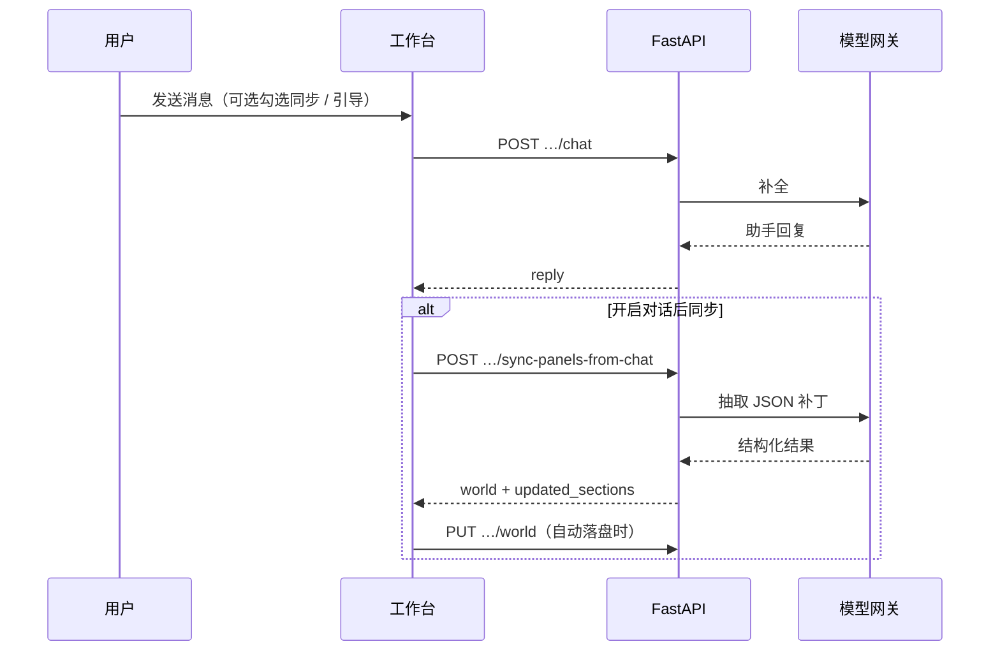
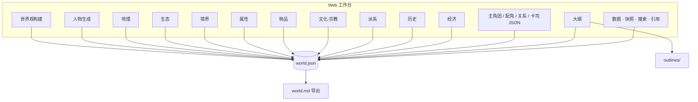
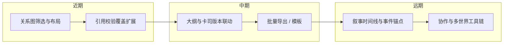

<div align="center">


**把对话里的灵感，落成可保存、可导出的完整世界。**

[](https://www.python.org/)
[](https://fastapi.tiangolo.com/)
[](https://docs.pydantic.dev/)
[](https://pytest.org/)

</div>

---

## 目录

- [它能做什么](#它能做什么)
- [整体流程](#整体流程)
- [界面导览（图解）](#界面导览图解)
- [产品地图（工作台 ↔ world.json）](#产品地图工作台--worldjson)
- [功能一览](#功能一览)
- [后续路线](#后续路线)
- [环境要求](#环境要求)
- [安装依赖](#安装依赖)
- [配置](#配置)
- [启动服务](#启动服务)
- [调试（可选）](#调试可选)
- [数据目录](#数据目录结构)
- [API 摘要](#api-摘要)
- [测试](#测试)
- [更多文档](#更多文档)

---

## 它能做什么

世界观辅助工具：在本地持久化 **地理、生态、超凡力量、通用人物属性、物品品质、文化与宗教、派系与关系、世界历史、经济与流通、人物卡司**，并通过兼容 OpenAI 的 API（默认 `https://llmapi.paratera.com/v1`）进行对话补全。**人物与情节大纲**在生成前会强制读取当前世界的 `world.json`，结果写入 `worlds/<world_id>/outlines/`。

| | |
|:--|:--|
| 📌 **单一事实源** | 磁盘上的 `world.json` 为权威结构；`world.md` 为可读导出。 |
| 💬 **第一路** | 自然语言对话（世界观构建 / 人物生成），可选「附带 world.md」与多种 **创作模式**。 |
| 🧩 **第二路** | 勾选「对话后同步」时，再调模型把可落盘内容解析为 JSON，**合并进表单**；响应含 `merge_warnings`、`normalize_notes`、`updated_sections`。 |
| 💾 **保存** | 表单更新后需 **「保存世界」**（或 **Ctrl+S / ⌘S**）写入磁盘；部分对话流程会在同步后自动触发保存。 |
| 🚪 **退出** | 顶栏 **「退出」** 调用 `POST /api/shutdown`，结束本机 Uvicorn 进程并尝试关闭浏览器页（仅回环地址可调）。 |

第二路模型默认同主对话，可用 `STRUCTURE_SYNC_MODEL` 单独指定。

---

## 整体流程


**对话后同步与保存（概念时序）**



---

## 界面导览（图解）

以下为 **布局示意**（非真实截图，便于快速理解顶栏 / 侧栏 / 主区关系）。仓库内为矢量 SVG，缩放清晰。

<div align="center">


*顶栏：世界、保存、退出；左侧：工作台与世界观各模块；中间：对话或表单；右侧：看板与 JSON（随视图变化）*

</div>

---

## 产品地图（工作台 ↔ world.json）

下图概括 **单页应用** 中主要板块与本地 `world.json` 的对应关系（箭头表示「读写字段」而非运行时依赖顺序）。



**读图提示**

- 对话与「对话后同步」可能一次改多个小节；未保存前变更在内存表单中。
- 顶栏 **品牌横幅** 另见 [`docs/readme-hero.svg`](docs/readme-hero.svg)；**布局示意** 见 [`docs/readme-workbench.svg`](docs/readme-workbench.svg)。
- 文中 **Mermaid** 图在 GitHub、VS Code / Cursor 预览、或支持 Mermaid 的文档站中均可渲染。

---

## 功能一览

| 模块 | 说明 |
|:--|:--|
| **世界观构建** | 与架构师自然语言交流；**Ctrl+Enter** 发送；快捷词条（规划、写地理、境界、职业、技能树、人物属性、生态、**经济**、文化、派系等）；可选 **引导**（境界技能树、职业体系、人物属性、生态、**经济系统** 等，`chat_guides` 注入 system）；**派系要人** 与快照预览；可选「对话后同步」；若磁盘 **world.md 非空**，加载世界时常自动勾选「附带 world.md」 |
| **人物生成** | 独立对话线程 `character-chat`；可勾选「引导：人物卡司」与「对话后同步」；与左侧 **角色** 分区数据一致 |
| **地理** | 大陆 / 区域卡片、区域关系网络图；同步含地理归一化与稳定区域 id |
| **生态** | 生境群落、代表物种与遭遇话术；`ecology` 与地理、属性维度对齐；可选一键 **ecology-generate** |
| **境界** | 分境卡片、技能树、**职业体系**子页与 **职业晋升图谱**（Mermaid） |
| **属性** | 通用人物属性维度与雷达参照；`attribute_system` |
| **物品** | 品质档位卡片化预览 |
| **文化·宗教** | `cultures` 实体卡片与关系图（Mermaid） |
| **派系** | 总览、全局关系图（缩放 + 拖拽）、单卡简介 |
| **历史** | 时间轴与因果链导图 |
| **经济** | 货币、市场、商路、贸易品；对齐 `geography.regions` / `factions` id；同步写入 `economy` 后可自动切换到本页 |
| **角色** | 主角团、重要配角、人物关系网络、卡司 JSON；与 `characters` 节一致 |
| **大纲 / 数据** | 人物与情节大纲；**全文搜索**；**导出与快照**、diff、回滚；**引用一致性** 检查与保守修复 |

**世界管理**：顶栏 **新建 / 重命名 / 删除**；下拉列表展示 **显示名 · id**。

**看板（右侧）**：计数条、可折叠 **原始 JSON**、上下文等（随当前视图变化）。

**其它**：`meta.genre_tags` 会注入对话、结构化同步与大纲的 system 片段；工作台为 **单页静态前端 + FastAPI**（`/` 界面，`/api/*` 接口，`/static/*` 资源）。

---

## 后续路线

`characters` 与 **角色** 分区看板、**人物生成** 已在当前版本落地；后续可侧重 **可视化深化、大纲与卡司联动、导出模板** 等（详见 [`todolist.md`](todolist.md)）。



---

## 环境要求

- Python 3.10+（推荐与 `requirements.txt` 一致）
- 可选：使用 Paratera 或其它兼容网关时，需可用的 API Key 与模型名

---

## 安装依赖

在项目根目录执行：

```bash
pip install -r requirements.txt
```

若使用指定的 Conda 环境，可将 `python` 换为你的解释器路径，例如：

```powershell
& "E:\ananconda\envs\Agent\python.exe" -m pip install -r requirements.txt
```

---

## 配置

复制环境变量模板并编辑：

```bash
# Windows（PowerShell / CMD）
copy .env.example .env

# macOS / Linux
cp .env.example .env
```

常用变量（详见 `.env.example`）：

| 变量 | 说明 |
|:--|:--|
| `PARATERA_API_KEY` | 兼容 OpenAI 的 API 密钥；未设置时对话、大纲与板块同步会返回 **503**，其余读写世界仍可用 |
| `OPENAI_API_BASE` | 默认 `https://llmapi.paratera.com/v1` |
| `OPENAI_CHAT_MODEL` | 默认 `DeepSeek-V4-Flash`，请按网关实际可用模型修改 |
| `STRUCTURE_SYNC_MODEL` | 可选；对话后「板块结构化同步」所用模型，留空则与 `OPENAI_CHAT_MODEL` 相同 |
| `WORLDS_DIR` | 可选，自定义世界数据根目录（默认项目下 `worlds/`） |

### 临时设置 API Key（不写 `.env`）

适合一次性试用：只在**当前终端窗口**生效，关闭窗口后即失效，也不会把密钥写进仓库里的文件。

**Windows PowerShell**（先设变量，再在同一窗口里启动）：

```powershell
$env:PARATERA_API_KEY = "你的密钥"
python run.py
```

**Windows CMD**：

```bat
set PARATERA_API_KEY=你的密钥
python run.py
```

**macOS / Linux（bash/zsh）**：

```bash
export PARATERA_API_KEY="你的密钥"
python run.py
```

或单行（仅作用于这一条命令）：

```bash
PARATERA_API_KEY="你的密钥" python run.py
```

说明：应用通过 `python-dotenv` 读取 `.env`；若同时存在 `.env` 与上面的临时变量，**以当前进程环境变量为准**。临时密钥请勿提交到 Git。

---

## 启动服务

**推荐**：在项目根目录运行：

```bash
python run.py
```

启动约 1 秒后会在**系统默认浏览器**中自动打开工作台。若不需要自动打开，请加 **`--no-browser`**。

默认监听 **`http://127.0.0.1:8765`**。可勾选「对话后同步表单」以调用 `POST /api/worlds/{id}/sync-panels-from-chat`；勾选「仅同步当前页对应模块」时，仅当前导航对应模块写入，其它模块的结构化输出会被丢弃。

**顶栏「退出」**：停止本机服务进程（`POST /api/shutdown`，仅 `127.0.0.1` / `::1` 等回环可调）；成功后页面显示「服务已停止」并尝试关闭标签页。

常用参数：

```bash
python run.py --host 0.0.0.0 --port 8765
python run.py --reload
python run.py --no-browser
```

使用 **`--reload`** 时，会自动设置 **`MCW_NO_STATIC_CACHE=1`**：对 `/static/*` 禁止强缓存，避免 `app.js` 长期 **304** 仍用旧脚本。

等价方式：

```bash
python -m uvicorn app.main:app --host 127.0.0.1 --port 8765
```

---

## 调试（可选）

仓库含 **`.vscode/settings.json`**（示例解释器路径）与 **`.vscode/launch.json`**（调试 `run.py`）。在 Cursor / VS Code 中选配置后 **F5** 即可断点调试；若缺少调试器包，可在对应环境中执行 `pip install debugpy`。

---

## 数据目录结构

每个世界位于 `worlds/<world_id>/`：

| 文件 / 目录 | 说明 |
|:--|:--|
| `world.json` | 权威结构化设定 |
| `world.md` | 由程序从 JSON 导出的可读手册（保存或导出时更新） |
| `outlines/` | 人物 / 情节大纲（含 YAML 头：`based_on_world_id`、`based_on_world_version`） |
| `sessions/` | 对话片段日志（可选） |
| `manifest.json` | 创建时间与网关元信息（不含密钥） |

---

## API 摘要

| 方法 | 路径 | 说明 |
|:--|:--|:--|
| `GET` | `/api/health` | 健康检查 |
| `GET` | `/api/config` | 前端展示用配置（模型名、是否已配置 Key 等） |
| `POST` | `/api/shutdown` | 结束本机服务（仅回环）；用于顶栏「退出」 |
| `GET` | `/api/worlds` | 世界列表 |
| `POST` | `/api/worlds` | 创建世界 |
| `GET` | `/api/worlds/{id}` | 加载世界；含 `has_nonempty_world_md` |
| `PUT` | `/api/worlds/{id}` | 保存完整 `world` |
| `PATCH` | `/api/worlds/{id}` | 重命名显示名 |
| `DELETE` | `/api/worlds/{id}` | 删除整个世界目录 |
| `POST` | `/api/worlds/{id}/chat` | 世界观构建对话 |
| `POST` | `/api/worlds/{id}/character-chat` | 人物生成对话 |
| `POST` | `/api/worlds/{id}/sync-panels-from-chat` | 第二路结构化同步 |
| `POST` | `/api/worlds/{id}/ecology-generate` | 一键生成生态叙事 + 文末 JSON 块 |
| `POST` | `/api/worlds/{id}/outline` | 大纲生成 |
| `GET` | `/api/worlds/{id}/search` | 全文搜索 `world.json` + `world.md` |
| `GET` | `/api/worlds/{id}/lint-references` | 引用一致性检查 |
| `POST` | `/api/worlds/{id}/fix-references` | 保守自动修复（支持 `dry_run`） |
| `POST` | `/api/worlds/{id}/export-md` | 导出 `world.md` |
| `GET` | `/api/worlds/{id}/snapshots` | 内存快照列表 |
| `GET` | `/api/worlds/{id}/snapshots/diff` | 快照与当前 JSON 行 diff |
| `POST` | `/api/worlds/{id}/snapshots/rollback` | 回滚到指定快照版本 |
| `POST` | `/api/worlds/{id}/refresh/faction-relations` | 重算派系关系图数据 |
| `POST` | `/api/worlds/{id}/refresh/culture-relations` | 重算文化实体关系 |

---

## 测试

```bash
python -m pytest tests -q
```

---

## 更多文档

| 文档 | 内容 |
|:--|:--|
| [`docs/readme-hero.svg`](docs/readme-hero.svg) | 仓库首页用横幅图（矢量） |
| [`docs/readme-workbench.svg`](docs/readme-workbench.svg) | 工作台布局示意（矢量） |
| [`todolist.md`](todolist.md) | 路线图、架构速记与 backlog |
| [`.cursor/skills/`](.cursor/skills/) | Cursor Agent Skills（如 `worldforger-factions`、`worldforger-economy`、各创作载体 skill） |
