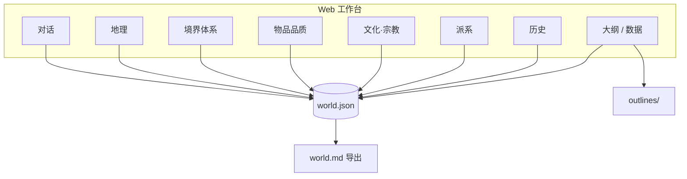
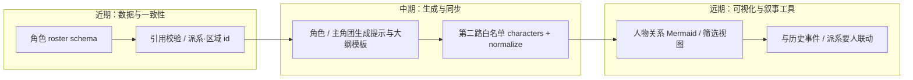

<div align="center">


**把对话里的灵感，落成可保存、可导出的完整世界。**

[](https://www.python.org/)
[](https://fastapi.tiangolo.com/)
[](https://docs.pydantic.dev/)
[](https://pytest.org/)

</div>

---

## 目录

- [它能做什么](#它能做什么)
- [整体流程](#整体流程)
- [产品地图（工作台）](#产品地图工作台)
- [功能一览](#功能一览)
- [后续路线：角色与关系网络](#后续路线角色与关系网络)
- [环境要求](#环境要求)
- [安装依赖](#安装依赖)
- [配置](#配置)
- [启动服务](#启动服务)
- [数据目录](#数据目录结构)
- [API 摘要](#api-摘要)
- [测试](#测试)
- [更多文档](#更多文档)

---

## 它能做什么

世界观辅助工具：在本地持久化 **地理、超凡力量、物品品质、文化与宗教、派系与关系、世界历史**，并通过兼容 OpenAI 的 API（默认 `https://llmapi.paratera.com/v1`）进行对话补全。**人物与情节大纲**在生成前会强制读取当前世界的 `world.json`，结果写入 `worlds/<world_id>/outlines/`。

**双路模型（Web 工作台）**

| 路径 | 角色 | 说明 |
|:--|:--|:--|
| **第一路** | 世界观架构师 | 自然语言对话，补全与修订设定 |
| **第二路** | 结构化同步器 | 对话后（可选）再调模型，把可落盘内容解析为 JSON，**自动填回**各模块表单；支持 `normalize_notes`（归一化说明）与 `merge_warnings`（校验提示） |

表单更新后仍需手动 **「保存世界」**（或 **Ctrl+S / ⌘S**）才写入 `world.json`。第二路模型默认同主对话，可用 `STRUCTURE_SYNC_MODEL` 单独指定。

---

## 整体流程


---

## 产品地图（工作台）

下图概括 **单页应用** 中各板块与本地 `world.json` 的对应关系（箭头表示「读写字段」而非运行时依赖顺序）。



**读图提示**：对话与「对话后同步」可能批量改多个小节；保存前变更驻留在内存表单，**保存世界** 后写入磁盘。顶栏 **SVG 横幅** 见仓库内 [`docs/readme-hero.svg`](docs/readme-hero.svg)；文中 **Mermaid** 图在 GitHub、VS Code 预览或工作台同源技术栈中均可渲染。

---

## 功能一览

| 模块 | 说明 |
|:--|:--|
| **对话** | 与架构师聊天；**Ctrl+Enter** 快捷发送；快捷词条（含文化·宗教、**派系要人**）；对话区 **派系要人快照**（各派系 `key_figures` 预览，与派系页卡片或未保存编辑一致）；可选「对话后同步表单」；若磁盘上 **world.md 非空**，加载世界时会**自动勾选**「附带 world.md 上下文」 |
| **地理** | 大陆 / 区域卡片、区域关系网络图、区域类型图标；结构化同步含地理归一化与稳定区域 id（`rg_*`） |
| **力量 / 物品** | 分境界 / 分档卡片化预览（能力、限制、范例等）；**职业体系**子页含按境编辑的 `profession_system` 与 **职业晋升图谱**（Mermaid：相邻境界相同 `professions[].id` 视为晋升连线） |
| **文化·宗教** | `cultures` 总览与实体卡片、关系图（Mermaid）；第二路白名单键 **`cultures`**；可与创作模式提示联动 |
| **派系** | 总览预览、全局关系图（缩放 + 拖拽平移）、单卡简介与关系小图 |
| **历史** | 大事件时间轴、因果链导图 |
| **大纲 / 数据** | 人物与情节大纲；**搜索**（全文检索磁盘 `world.json` / `world.md`）；**导出与快照**（导出 `world.md`、内存 `world.json` 快照、复制世界 ID） |

**世界管理**：顶栏可 **重命名**（`PATCH`，仅改显示名与 `meta.name`）、**删除**（`DELETE` 整目录）；世界下拉列表显示 **显示名 · id**。

**看板（右侧）**：**引用一致性** 调用 `GET …/lint-references` 对照磁盘 world 检查跨 id 引用；**保存世界** 成功后会静默再跑一遍，若有提示会 toast 并写入下列表。`meta.genre_tags`（若在世界 JSON 中填写）会作为 system 片段注入 **对话**、**对话后结构化同步** 与 **大纲生成**。`/` 为界面，`/api/*` 为接口，`/static/*` 为前端资源（根路径不整站挂载静态目录，避免抢占 API）。

---

## 后续路线：角色与关系网络

当前版本已把 **地理、力量、物品、文化、派系、历史、大纲** 等结构化进 `world.json`，并有多处 **Mermaid 关系图**（派系、文化、历史、地理、职业晋升等）。**人物**仍以大纲与对话产出为主，尚未有独立的「角色卡 + 关系边」数据节与专用视图。

以下为建议的 **下游迭代顺序**（详细拆解见 [`todolist.md`](todolist.md) 中「下游任务：角色、主角团与关系网络」）。



| 方向 | 说明 |
|:--|:--|
| **角色生成** | 基于当前 `world.json` 与可选 `world.md`，在「大纲」或新接口中生成单卡（动机、秘密、声口、与派系/区域挂钩字段）。 |
| **主角团** | 在 roster 中增加角色类标签（如 `cast_role: protagonist_core`），便于导出与对话芯片引用。 |
| **关键配角** | 与 `factions.key_figures`、历史事件参与者对齐 id，减少「同名不同人」。 |
| **人物关系网络** | 存 `relations[]`（`source_id`、`target_id`、`type`、`notes`），前端复用派系图缩放模式做 **人物关系图**。 |

---

## 环境要求

- Python 3.10+（推荐与 `requirements.txt` 一致）
- 可选：使用 Paratera 或其它兼容网关时，需可用的 API Key 与模型名

---

## 安装依赖

在项目根目录执行：

```bash
pip install -r requirements.txt
```

若使用指定的 Conda 环境，可将 `python` 换为你的解释器路径，例如：

```powershell
& "E:\ananconda\envs\Agent\python.exe" -m pip install -r requirements.txt
```

---

## 配置

复制环境变量模板并编辑：

```bash
# Windows（PowerShell / CMD）
copy .env.example .env

# macOS / Linux
cp .env.example .env
```

常用变量（详见 `.env.example`）：

| 变量 | 说明 |
|:--|:--|
| `PARATERA_API_KEY` | 兼容 OpenAI 的 API 密钥；未设置时对话、大纲与板块同步会返回 **503**，其余读写世界仍可用 |
| `OPENAI_API_BASE` | 默认 `https://llmapi.paratera.com/v1` |
| `OPENAI_CHAT_MODEL` | 默认 `DeepSeek-V4-Flash`，请按网关实际可用模型修改 |
| `STRUCTURE_SYNC_MODEL` | 可选；对话后「板块结构化同步」所用模型，留空则与 `OPENAI_CHAT_MODEL` 相同 |
| `WORLDS_DIR` | 可选，自定义世界数据根目录（默认项目下 `worlds/`） |

### 临时设置 API Key（不写 `.env`）

适合一次性试用：只在**当前终端窗口**生效，关闭窗口后即失效，也不会把密钥写进仓库里的文件。

**Windows PowerShell**（先设变量，再在同一窗口里启动）：

```powershell
$env:PARATERA_API_KEY = "你的密钥"
python run.py
```

**Windows CMD**：

```bat
set PARATERA_API_KEY=你的密钥
python run.py
```

**macOS / Linux（bash/zsh）**：

```bash
export PARATERA_API_KEY="你的密钥"
python run.py
```

或单行（仅作用于这一条命令）：

```bash
PARATERA_API_KEY="你的密钥" python run.py
```

说明：应用通过 `python-dotenv` 读取 `.env`；若同时存在 `.env` 与上面的临时变量，**以当前进程环境变量为准**。临时密钥请勿提交到 Git。

---

## 启动服务

**推荐**：在项目根目录运行：

```bash
python run.py
```

启动约 1 秒后会在**系统默认浏览器**中自动打开工作台（`127.0.0.1` 与端口一致；监听 `0.0.0.0` 时仍打开本机 `127.0.0.1`）。若不需要自动打开，请加 **`--no-browser`**。

默认监听 **`http://127.0.0.1:8765`**。可勾选「对话后同步表单」以调用 `POST /api/worlds/{id}/sync-panels-from-chat`；勾选「仅同步当前页对应模块」时，仅在当前导航对应模块写入（地理 / 力量 / 物品 / **文化·宗教** / 派系 / 历史等），其它模块输出会被丢弃。合并时对**空数组 / 空白字符串**采用保守策略，避免误清空已有内容。

常用参数：

```bash
python run.py --host 0.0.0.0 --port 8765
python run.py --reload
python run.py --no-browser
```

等价方式（未使用 `run.py` 时）：

```bash
python -m uvicorn app.main:app --host 127.0.0.1 --port 8765
```

---

## 数据目录结构

每个世界位于 `worlds/<world_id>/`：

| 文件 / 目录 | 说明 |
|:--|:--|
| `world.json` | 权威结构化设定（含 `cultures` 等节） |
| `world.md` | 由程序从 JSON 导出的可读手册（保存或导出时更新） |
| `outlines/` | 人物 / 情节大纲（含 YAML 头：`based_on_world_id`、`based_on_world_version`） |
| `sessions/` | 对话片段日志（可选） |
| `manifest.json` | 创建时间与网关元信息（不含密钥） |

---

## API 摘要

| 方法 | 路径 | 说明 |
|:--|:--|:--|
| `GET` | `/api/worlds` | 世界列表：`[{ id, name }, …]`（`name` 来自 `meta.name`） |
| `POST` | `/api/worlds` | 创建世界 |
| `GET` | `/api/worlds/{id}` | `{ "world": …, "has_nonempty_world_md": bool }`；前端据此自动勾选对话「附带 world.md」 |
| `PUT` | `/api/worlds/{id}` | 保存完整 `world` |
| `PATCH` | `/api/worlds/{id}` | 重命名：`{ "name": "…" }`（不改目录 id） |
| `DELETE` | `/api/worlds/{id}` | 删除整个世界目录 |
| `POST` | `/api/worlds/{id}/chat` | 对话 |
| `POST` | `/api/worlds/{id}/sync-panels-from-chat` | 第二路结构化同步；成功响应含 `merge_warnings`、`normalize_notes` |
| `POST` | `/api/worlds/{id}/outline` | 大纲 |
| `GET` | `/api/worlds/{id}/search` | 全文搜索：`q` 查询磁盘 `world.json` + `world.md` |
| `GET` | `/api/worlds/{id}/lint-references` | 纯本地引用一致性检查（地理/派系/文化/历史/境界等 id），返回 `warnings`、`ok`、`counts` |
| `POST` | `/api/worlds/{id}/export-md` | 重新导出 `world.md` |

---

## 测试

```bash
python -m pytest tests -q
```

---

## 更多文档

| 文档 | 内容 |
|:--|:--|
| [`todolist.md`](todolist.md) | 路线图、**下游任务（角色生成 / 主角团 / 关键配角 / 人物关系网络）**、架构速记与 backlog |
| [`.cursor/skills/`](.cursor/skills/) | Cursor Agent Skills（如 `worldforger-factions`、`worldforger-cultures-religions`、各创作载体 skill） |
