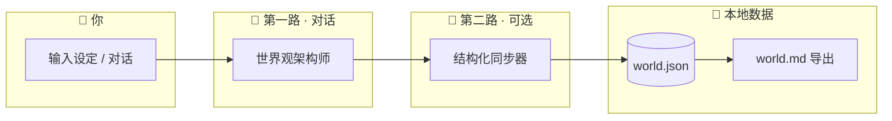
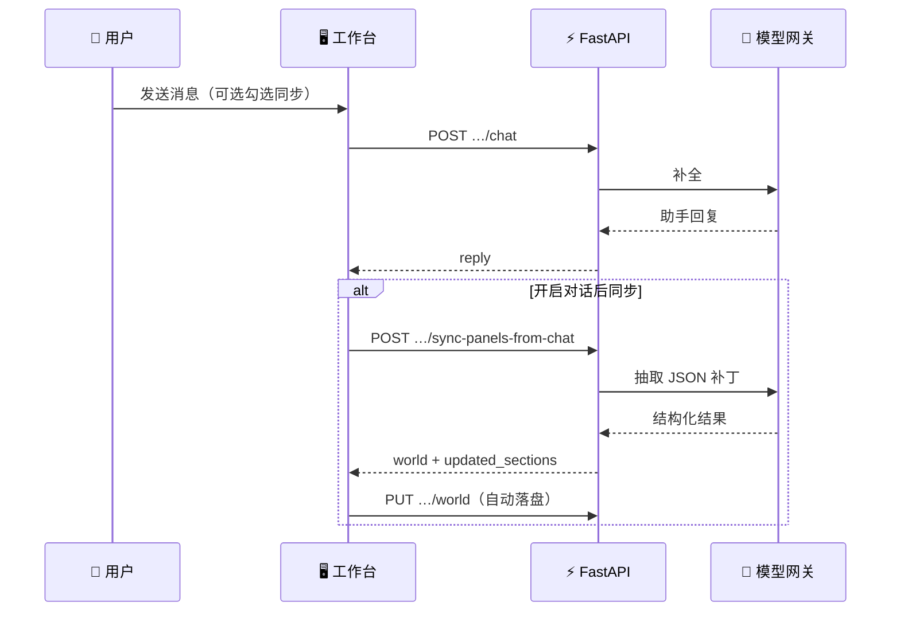
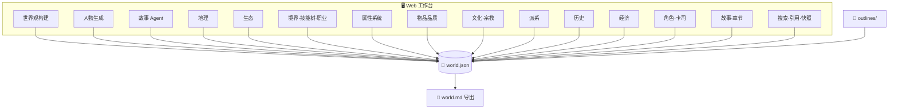
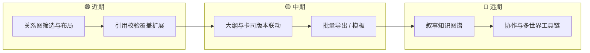

<div align="center">


**把对话里的灵感，落成可保存、可导出的完整世界。**

[](https://www.python.org/)
[](https://fastapi.tiangolo.com/)
[](https://docs.pydantic.dev/)
[](https://pytest.org/)
[](https://platform.openai.com/)

</div>

<p align="center">
  <a href="README.md"></a>
  <a href="README.en.md"></a>
</p>

---

## 目录

- [快速开始](#快速开始)
- [它能做什么](#它能做什么)
- [界面导览](#界面导览)
- [整体流程](#整体流程)
- [功能一览](#功能一览)
- [产品地图](#产品地图工作台--worldjson)
- [环境要求与安装](#环境要求与安装)
- [配置](#配置)
- [启动服务](#启动服务)
- [数据目录结构](#数据目录结构)
- [API 摘要](#api-摘要)
- [测试](#测试)
- [后续路线](#后续路线)
- [更多文档](#更多文档)

---

## 快速开始

```bash
# 1. 安装依赖
pip install -r requirements.txt

# 2. 配置 API Key
cp .env.example .env          # Linux / macOS
copy .env.example .env        # Windows
# 编辑 .env，填入 PARATERA_API_KEY

# 3. 启动
python run.py
```

浏览器自动打开 `http://127.0.0.1:8765`，即可开始构建你的世界观。

---

## 它能做什么

**Magic Creater World (MCW)** 是一个本地优先、AI 辅助的虚构世界观构建工作台。它将 LLM 对话的灵感转化为可持久化、可导出的结构化数据。

<div align="center">

| ✨ 核心特性 | 说明 |
|:--|:--|
| 📌 **单一事实源** | 磁盘上的 `world.json` 为权威结构；`world.md` 为可读导出 |
| 💬 **对话构建** | 与"世界观架构师"自然语言交流，4 种创作模式（小说 / 游戏 / CoC / DnD） |
| 🧩 **结构化同步** | 勾选「对话后同步」，LLM 自动抽取 JSON 补丁合并进表单 |
| 🗺️ **11 个世界观模块** | 地理 · 生态 · 境界 · 属性 · 物品 · 文化 · 派系 · 历史 · 经济 · 角色 · 故事 |
| 📊 **关系可视化** | Mermaid 图表：关系网络、技能树、职业晋升图、时间线、因果链 |
| 🧠 **语义记忆 (RAG)** | 本地向量索引（ChromaDB），智能检索前文片段保持叙事连贯性 |
| 🔍 **数据工具** | 全文搜索、引用一致性检查与修复、版本快照与 diff 回滚 |
| 📤 **导出** | 自动生成 `world.md` 人类可读手册；大纲写入 `outlines/` |
| 💾 **本地优先** | 所有数据在本地磁盘，无需云端服务 |

</div>

### 两条对话路径

| 路径 | 说明 |
|:--|:--|
| **第一路 · 对话** | 自然语言与"世界观架构师"交流；可选附带 `world.md` 上下文 |
| **第二路 · 结构同步** | 勾选后，再调模型把可落盘内容解析为 JSON，合并进表单 |

第二路模型默认同主对话，可用 `STRUCTURE_SYNC_MODEL` 单独指定。

---

## 界面导览

工作台采用**三栏布局**：顶栏 + 左侧导航 + 中间主区 + 右侧看板。

<div align="center">


*顶栏：世界选择、保存、退出；左侧：对话与世界观各模块导航；中间：对话或表单编辑区；右侧：统计看板与 JSON 查看器*

</div>

### 对话视图


*同步选项、创作模式选择、快捷词条、消息列表、输入框（Ctrl+Enter 发送）*

---

## 整体流程



**对话后同步与保存（时序）**



---

## 功能一览

### 🌍 世界观模块（11 个）

| 模块 | 核心功能 | 可视化 |
|:--|:--|:--|
| **地理** | 大陆 / 区域卡片；区域关系 | 关系网络图（Mermaid） |
| **生态** | 生境群落、代表物种、遭遇话术 | 一键 AI 生态生成 |
| **境界** | 分境卡片、技能树、职业体系 | 职业晋升图谱（Mermaid） |
| **属性** | 通用人物属性维度定义 | 雷达参照图 |
| **物品** | 品质档位卡片化预览 | 稀有度叙事 |
| **文化·宗教** | 文化 / 宗教 / 融合实体卡片 | 实体关系图（Mermaid） |
| **派系** | 组织总览、单卡简介 | 全局关系图（缩放+拖拽） |
| **历史** | 重大事件管理 | 时间轴 + 因果链导图 |
| **经济** | 货币、市场、商路、贸易品 | 与地理/派系 id 对齐 |
| **角色** | 主角团、重要配角、卡司 JSON | 人物关系网络 |
| **故事** | 章节、宏大纲、节拍大纲、手稿 | 伏笔时间线 · RAG 语义检索 |

### 🤖 AI 对话能力

| 功能 | 说明 |
|:--|:--|
| **世界观构建对话** | 与架构师自由交流；快捷词条引导；Ctrl+Enter 发送 |
| **人物生成对话** | 独立对话线程；可配合引导与结构化同步 |
| **故事 Agent** | 工具调用：伏笔查询/埋设/回收、手稿生成、自动识别 markdown 代码块 |
| **RAG 语义检索** | 本地向量索引（ChromaDB + BGE embedding），智能检索相关前文片段注入写作上下文 |
| **创作模式** | 小说 / 游戏 / CoC / DnD，注入不同 system prompt 与词汇表 |
| **一键生态生成** | 基于当前世界观上下文自动生成生态设定 |

### 🔧 数据工具

| 工具 | 说明 |
|:--|:--|
| **全文搜索** | 同时搜索 `world.json` 与 `world.md` |
| **引用一致性检查** | 跨模块 id 引用校验（区域、派系等） |
| **自动修复** | 保守修复引用问题，支持 `dry_run` 预览 |
| **版本快照** | 每次保存自动快照；diff 查看；一键回滚；单个快照删除 |
| **RAG 索引就绪指示** | 情节工作台顶栏状态点 + 侧边上下文面板（前章摘要 / 角色状态 / 索引统计） |
| **world.md 导出** | 从 JSON 自动生成人类可读手册 |

### 🌐 世界管理

顶栏提供 **新建 / 重命名 / 删除** 世界；下拉列表展示 **显示名 · id**；**保存**（Ctrl+S / ⌘S）写入磁盘；**退出** 关闭服务进程。

---

## 产品地图（工作台 ↔ world.json）

下图概括单页应用中主要板块与本地 `world.json` 的对应关系。



---

## 环境要求与安装

### 环境要求

- **Python 3.10+**
- 兼容 OpenAI API 的网关（默认 `https://llmapi.paratera.com/v1`）及可用 API Key

### 安装依赖

```bash
pip install -r requirements.txt
```

依赖清单：

| 包 | 用途 |
|:--|:--|
| `fastapi` | Web API 框架 |
| `uvicorn` | ASGI 服务器 |
| `openai` | LLM 客户端（OpenAI 兼容） |
| `pydantic` + `pydantic-settings` | 数据验证与配置管理 |
| `python-dotenv` | 环境变量加载 |
| `httpx` | 异步 HTTP 客户端 |
| `chromadb` | 本地向量数据库（RAG 语义检索） |
| `sentence-transformers` | 本地文本 embedding（BAAI/bge-small-zh-v1.5） |
| `pytest` | 测试框架 |

若使用 Conda 环境，可指定解释器路径：

```powershell
& "E:\ananconda\envs\Agent\python.exe" -m pip install -r requirements.txt
```

---

## 配置

复制环境变量模板并编辑：

```bash
# Linux / macOS
cp .env.example .env

# Windows (PowerShell / CMD)
copy .env.example .env
```

常用变量：

| 变量 | 说明 | 默认值 |
|:--|:--|:--|
| `PARATERA_API_KEY` | 兼容 OpenAI 的 API 密钥 | *(必填)* |
| `OPENAI_API_BASE` | API 网关地址 | `https://llmapi.paratera.com/v1` |
| `OPENAI_CHAT_MODEL` | 对话模型 | `DeepSeek-V4-Flash` |
| `STRUCTURE_SYNC_MODEL` | 可选：结构化同步专用模型 | 同 `OPENAI_CHAT_MODEL` |
| `MCW_EMBEDDING_MODEL` | 可选：本地 embedding 模型名 | `BAAI/bge-small-zh-v1.5` |
| `MCW_EMBEDDING_BACKEND` | `auto` / `api` / `local`：无本地缓存时 `auto` 不走 HuggingFace，直接 API | `auto` |
| `MCW_HF_ENDPOINT` | 可选：Hugging Face 镜像（如 `https://hf-mirror.com`） | *(空)* |
| `WORLDS_DIR` | 可选：自定义世界数据根目录 | `worlds/` |

> 💡 **临时设置密钥**（不写 `.env`，关闭终端即失效）：
>
> ```bash
> # Windows PowerShell
> $env:PARATERA_API_KEY = "你的密钥"
> python run.py
>
> # macOS / Linux
> PARATERA_API_KEY="你的密钥" python run.py
> ```

---

## 启动服务

### 基本启动

```bash
python run.py
```

启动约 1 秒后在默认浏览器中自动打开 `http://127.0.0.1:8765`。

### 常用参数

| 参数 | 说明 |
|:--|:--|
| `--host 0.0.0.0` | 监听所有网络接口 |
| `--port 8765` | 自定义端口 |
| `--reload` | 代码变更自动重载（开发模式） |
| `--no-browser` | 不自动打开浏览器 |

```bash
# 局域网访问
python run.py --host 0.0.0.0 --port 8765

# 开发调试
python run.py --reload
```

> 使用 `--reload` 时自动设置 `MCW_NO_STATIC_CACHE=1`，禁用前端缓存避免 app.js 长期 304。

### 等价启动方式

```bash
python -m uvicorn app.main:app --host 127.0.0.1 --port 8765
```

### 退出

顶栏**「退出」**调用 `POST /api/shutdown`，停止 Uvicorn 进程并尝试关闭浏览器标签页（仅回环地址可调用）。

---

## 数据目录结构

每个世界位于 `worlds/<world_id>/`：

```
worlds/
└── 诸神黄昏-58bddae5/
    ├── world.json          ← 权威结构化设定
    ├── world.md            ← 人类可读手册（自动导出）
    ├── manifest.json       ← 创建时间与网关元信息
    ├── outlines/           ← 人物 / 情节大纲导出
    ├── story/               ← 章节手稿、摘要卡片、RAG 索引
    │   ├── macro_outline.md
    │   ├── ch_xxx_manuscript.md
    │   ├── ch_xxx_summary_card.json
    │   └── rag_index/        ← ChromaDB 向量索引
    ├── sessions/           ← 对话片段日志（可选）
    └── snapshots/          ← 版本快照
        ├── v001.json
        ├── v002.json
        └── ...
```

---

## API 摘要

> 完整路由定义见 `app/main.py`。

| 方法 | 路径 | 说明 |
|:--|:--|:--|
| `GET` | `/api/health` | 健康检查 |
| `GET` | `/api/config` | 公开配置（模型名、Key 状态等） |
| `POST` | `/api/shutdown` | 停止服务（仅回环） |
| `GET` | `/api/worlds` | 世界列表 |
| `POST` | `/api/worlds` | 创建世界 |
| `GET` | `/api/worlds/{id}` | 加载世界 |
| `PUT` | `/api/worlds/{id}` | 保存完整 world |
| `PATCH` | `/api/worlds/{id}` | 重命名显示名 |
| `DELETE` | `/api/worlds/{id}` | 删除世界 |
| `POST` | `/api/worlds/{id}/chat` | 世界观对话 |
| `POST` | `/api/worlds/{id}/character-chat` | 人物生成对话 |
| `POST` | `/api/worlds/{id}/story-chat` | 故事 Agent 对话 |
| `POST` | `/api/worlds/{id}/sync-panels-from-chat` | 结构化同步 |
| `POST` | `/api/worlds/{id}/ecology-generate` | 一键生态生成 |
| `POST` | `/api/worlds/{id}/outline` | 大纲生成 |
| `GET` | `/api/worlds/{id}/search` | 全文搜索 |
| `GET` | `/api/worlds/{id}/lint-references` | 引用一致性检查 |
| `POST` | `/api/worlds/{id}/fix-references` | 自动修复引用 |
| `POST` | `/api/worlds/{id}/export-md` | 导出 world.md |
| `GET` | `/api/worlds/{id}/snapshots` | 快照列表 |
| `GET` | `/api/worlds/{id}/snapshots/diff` | 快照行级 diff |
| `POST` | `/api/worlds/{id}/snapshots/rollback` | 回滚到快照 |
| `DELETE` | `/api/worlds/{id}/snapshots/{version}` | 删除单个快照 |
| `DELETE` | `/api/worlds/{id}/snapshots` | 清空全部快照 |
| `POST` | `/api/worlds/{id}/refresh/faction-relations` | 重算派系关系 |
| `POST` | `/api/worlds/{id}/refresh/culture-relations` | 重算文化关系 |
| `GET` | `/api/worlds/{id}/story/rag/stats` | RAG 索引统计与就绪状态 |
| `*` | `/api/worlds/{id}/story/*` | 故事 CRUD（章节/大纲/节拍/手稿/伏笔） |

---

## 测试

```bash
python -m pytest tests -q
```

VS Code / Cursor 中可使用 `.vscode/launch.json` 配置 F5 调试；需安装 `debugpy`。

---

## 后续路线



详见 [`todolist.md`](todolist.md)。

---

## 更多文档

| 文档 | 内容 |
|:--|:--|
| [`docs/readme-hero.svg`](docs/readme-hero.svg) | 仓库首页横幅图（矢量） |
| [`docs/readme-workbench.svg`](docs/readme-workbench.svg) | 工作台布局示意（矢量） |
| [`docs/gui-chat-and-sync.svg`](docs/gui-chat-and-sync.svg) | 对话与同步流程示意 |
| [`docs/gui-workbench-layout.svg`](docs/gui-workbench-layout.svg) | 三栏布局详解示意 |
| [`todolist.md`](todolist.md) | 路线图、架构速记与 backlog |
| [`.cursor/skills/`](.cursor/skills/) | Cursor Agent Skills（9 个模块专属 skill） |

---

<div align="center">

**❤️ 为世界创造者，游戏工作者，和每一个具有奇思妙想的Idea而创建。**

</div>
